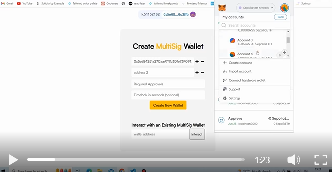

# Multi-Sig Wallet Creator
Create MultiSig wallet Contracts in seconds and collaboratively decide whether a blockchain transaction must go through or not.

[See Live Demo of the dApp](https://www.linkedin.com/posts/bhimgouda-patil-05a254269_solidity-100daysofcode-activity-7079107966322233344-2yvz?utm_source=share&utm_medium=member_desktop)

-You can add as many signers/owners as you want.
-You can also set a timelock.
-You add funds to wallet
-You create a transaction
-Transaction get signed/approved by required owners
-You wait for the timelock to end
-And only then it can be executed by any of the respective owners

### So how does all this work? 🙃 

----------It has 3 main pieces to it---------
1. Backend Smart contract - The Backbone
3. Frontend App - For clients to interact with the dApp

As long as you have some Sepolia ETH in your wallet, you are all set to interact with the dApp.

[Check Verified Contracts of this dApp on Sepolia testnet](https://sepolia.etherscan.io/address/0xF9C3D219F6047964480fb43Fd123162C841c5Db8)
